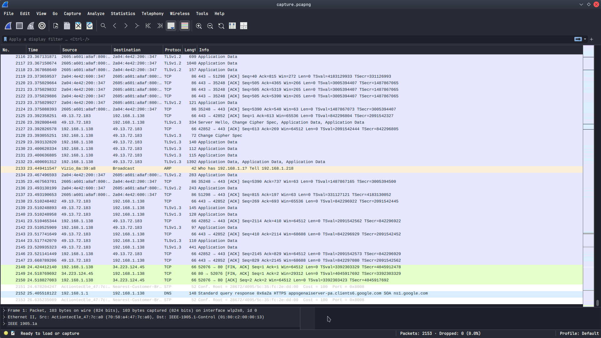
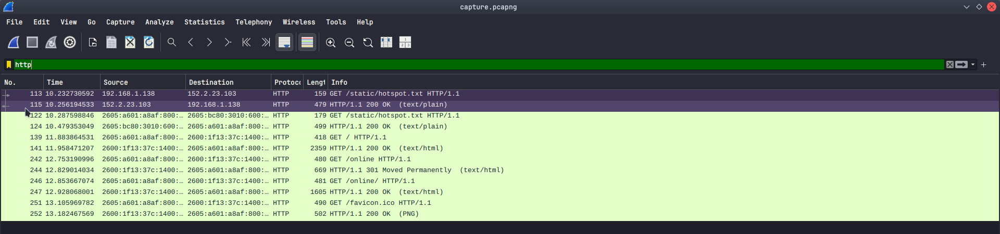
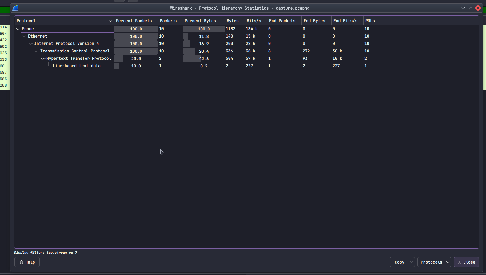
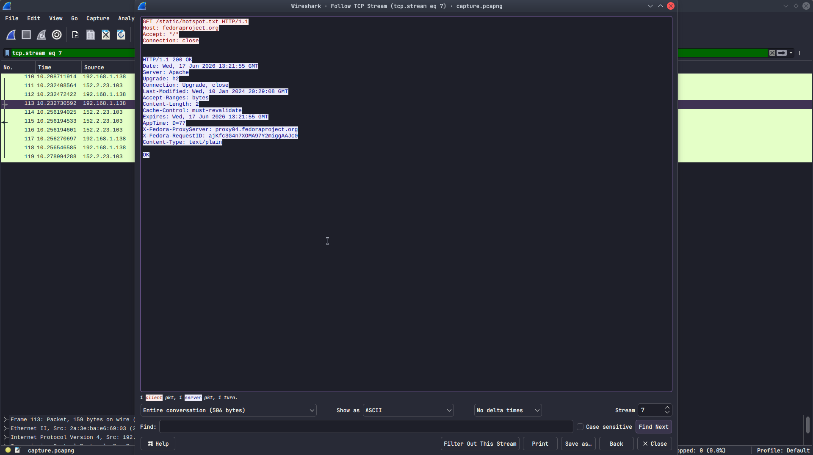

# Wireshark Traffic Analysis Lab
## Why This Matters
Network traffic analysis is a core skill for IT support and security roles. This lab demonstrates my ability to use Wireshark to investigate network activity and identify protocols.
## Project Overview
Captured and analyzed live network traffic on my home network using Wireshark on Fedora Linux.

## Tools Used
- Fedora Linux
- Wireshark 4.6.4

## What I Did
- Captured live traffic on home WiFi (wlp2s0)
- Applied display filters to isolate HTTP and DNS traffic
- Followed a TCP stream to inspect raw data
- Identified protocols: HTTP, TCP, DNS, ARP

## Key Findings
- Observed HTTP requests to fedoraproject.org
- Followed TCP stream showing full request/response cycle
- DNS queries resolved domain names before HTTP requests
- Normal ARP traffic for local network discovery
## Screenshots

### Full Capture

### HTTP Filtered Traffic

### Protocol Hierarchy

### TCP Stream Follow

## What I Learned
- Filtering traffic by protocol (`http`, `dns`)
- Following TCP streams to see full conversations
- Identifying cleartext vs encrypted traffic
- Real-world network investigation workflow

## Connect With Me
- **Email:** dtemplet578@gmail.com
- **GitHub:** [github.com/d-templet](https://github.com/d-templet)
- **LinkedIn:** [linkedin.com/in/dee-templet-289611360](https://linkedin.com/in/dee-templet-289611360)
